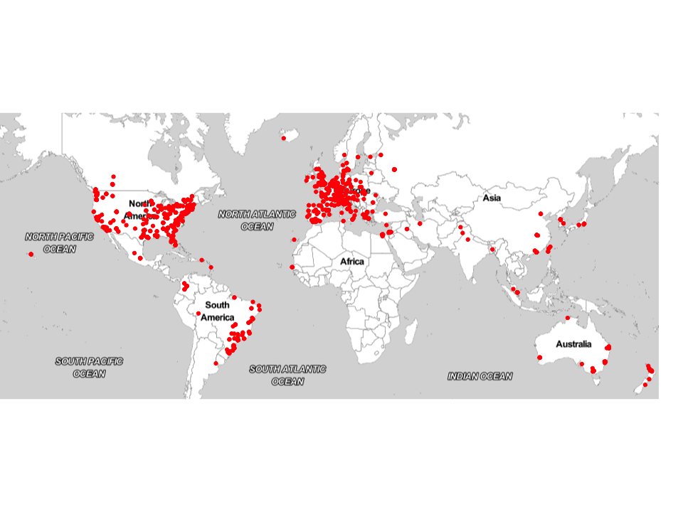
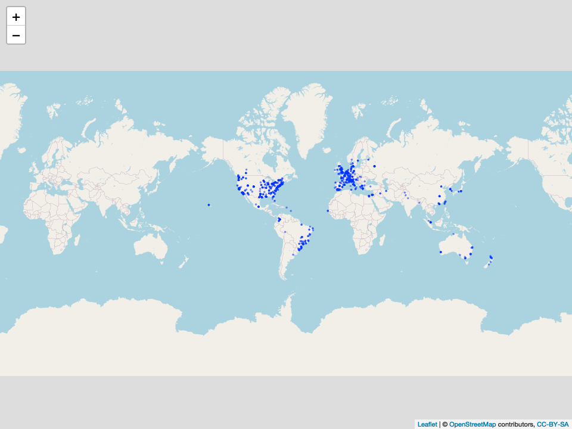

Ojo publico - mapping clinical trial data
================
Martin Frigaard
2020-06-10

# Motivation

This document outlines how we mapped clinical trials for the following
covid-19 treatments: Ivermectin, Remdesivir, Tocilizumab, and
Hydroxychloroquine + Azithromycin

## Import the clinical trial data

The code chunk below imports the clinical trials for using `Ivermectin`,
`Remdesivir`, `Tocilizumab`, and `Hydroxychloroquine + Azithromycin`
against COVID-19:

``` r
fs::dir_info("data/clinical-trials-gov/", recurse = TRUE) %>% 
  dplyr::arrange(desc(path)) %>% 
  dplyr::filter(str_detect(string = path, pattern = "AllCovidTrials.csv")) %>% 
  dplyr::select(path) %>% 
  purrr::as_vector() -> covid19_trials_csvs
# covid19_trials_csvs[1]
COVID19Trials <- readr::read_csv(covid19_trials_csvs[1])
```

    #>  Parsed with column specification:
    #>  cols(
    #>    .default = col_character(),
    #>    rank = col_double(),
    #>    enrollment = col_double(),
    #>    results_first_posted = col_logical()
    #>  )

    #>  See spec(...) for full column specifications.

``` r
COVID19Trials %>% glimpse(78)
```

    #>  Rows: 167
    #>  Columns: 29
    #>  $ source                  <chr> "data/clinical-trials-gov/2020-06-10/2020-0…
    #>  $ rank                    <dbl> 1, 2, 3, 4, 5, 6, 7, 8, 9, 10, 11, 12, 13, …
    #>  $ nct_number              <chr> "NCT04390594", "NCT04321278", "NCT04374903"…
    #>  $ title                   <chr> "Efficacy and Safety Evaluation of Treatmen…
    #>  $ acronym                 <chr> "SEN-CoV-Fadj", NA, "COVID19-HOPE", "COVIDO…
    #>  $ status                  <chr> "Not yet recruiting", "Recruiting", "Not ye…
    #>  $ study_results           <chr> "No Results Available", "No Results Availab…
    #>  $ conditions              <chr> "COVID-19", "Coronavirus Infections|Pneumon…
    #>  $ interventions           <chr> "Drug: Hydroxychloroquine|Drug: Hydroxychlo…
    #>  $ outcome_measures        <chr> "SARS-CoV-2 viral load level|Vital status|P…
    #>  $ sponsor_collaborators   <chr> "Institut Pasteur de Dakar|Fann Hospital, S…
    #>  $ gender                  <chr> "All", "All", "All", "All", "All", "All", "…
    #>  $ age                     <chr> "15 Years and older   (Child, Adult, Older …
    #>  $ phases                  <chr> "Phase 3", "Phase 3", "Not Applicable", "Ph…
    #>  $ enrollment              <dbl> 258, 440, 58, 150, 630, 456, 250, 444, 320,…
    #>  $ funded_bys              <chr> "Other", "Other|Industry", "Other", "Other"…
    #>  $ study_type              <chr> "Interventional", "Interventional", "Interv…
    #>  $ study_designs           <chr> "Allocation: Randomized|Intervention Model:…
    #>  $ other_i_ds              <chr> "2020-002", "30155020.5.1001.0071", "20 KHC…
    #>  $ start_date              <chr> "June 1, 2020", "March 28, 2020", "May 1, 2…
    #>  $ primary_completion_date <chr> "December 1, 2020", "August 30, 2020", "Aug…
    #>  $ completion_date         <chr> "June 1, 2021", "August 30, 2020", "Septemb…
    #>  $ first_posted            <chr> "May 15, 2020", "March 25, 2020", "May 5, 2…
    #>  $ results_first_posted    <lgl> NA, NA, NA, NA, NA, NA, NA, NA, NA, NA, NA,…
    #>  $ last_update_posted      <chr> "May 27, 2020", "May 27, 2020", "May 5, 202…
    #>  $ locations               <chr> "Infectious and Tropical Diseases Departmen…
    #>  $ study_documents         <chr> NA, NA, NA, NA, NA, NA, NA, NA, NA, NA, NA,…
    #>  $ url                     <chr> "https://ClinicalTrials.gov/show/NCT0439059…
    #>  $ drug                    <chr> "HCQ + Azithromycin", "HCQ + Azithromycin",…

## Mapping trial locations

Next we will be building a map of the clinical trial `locations`.

## Cleaning trial locations

The `locations` data separated by pipes, so we’ll remove the pipe and
get each location in it’s own row.

``` r
TidyTrialLocations <- COVID19Trials %>%
  # remove missing locations
  dplyr::filter(!is.na(locations)) %>%
    dplyr::mutate(locations =
    # 1) split this on the "updated" pattern
                  stringr::str_split(string = locations,
                                pattern = "\\|")) %>%
    # convert the output from split into multiple rows
        tidyr::unnest(locations) %>%
    # remove or from side_effect
    dplyr::mutate(locations = str_remove_all(string = locations,
                                               pattern = "\\|"))
TidyTrialLocations %>% 
  dplyr::select(drug, nct_number, locations) %>% 
  utils::head()
```

<div class="kable-table">

| drug               | nct\_number | locations                                                                  |
| :----------------- | :---------- | :------------------------------------------------------------------------- |
| HCQ + Azithromycin | NCT04390594 | Infectious and Tropical Diseases Department, Fann Hospital, Dakar, Senegal |
| HCQ + Azithromycin | NCT04390594 | Diamniadio Children Hospital, Diamniadio, Senegal                          |
| HCQ + Azithromycin | NCT04390594 | Dalal Jamm Hospital, Guédiawaye, Senegal                                   |
| HCQ + Azithromycin | NCT04321278 | Hospital de Urgência e Emergência de Rio Branco, Rio Branco, AC, Brazil    |
| HCQ + Azithromycin | NCT04321278 | Hospital e Clínica São Roque, Ipiaú, BA, Brazil                            |
| HCQ + Azithromycin | NCT04321278 | Hospital da Cidade, Salvador, BA, Brazil                                   |

</div>

Now we want to get the physical locations for each trial (`lat` and
`lng`).

``` r
library(ggmap)
library(plotly)
library(leaflet)
```

### The `ggmap` package

We’ll start with the `ggmap`.

The `ggmap` package is a handy method for geocoding addresses (see the
example code below).

Test this function for one location.

``` r
ggmap::geocode("Clinica Universidad de Navarra, Pamplona, Navarra, Spain")
```

    #>  Source : https://maps.googleapis.com/maps/api/geocode/json?address=Clinica+Universidad+de+Navarra,+Pamplona,+Navarra,+Spain&key=xxx

<div class="kable-table">

|        lon |      lat |
| ---------: | -------: |
| \-1.663439 | 42.80541 |

</div>

This is working, so now use `ggmap::geocode()` to iterate over the
locations stored in `locations`, I will use `purrr::map()` and return
the result to `GeoCodeTrialLoc`.

``` r
GeoCodeTrialLoc <- purrr::map_df(TidyTrialLocations$locations, ggmap::geocode)
```

Read this back in to make sure it’s all been saved

Check this new dataset for the `lat` and `lng`

``` r
GeoCodeTrialLoc %>% glimpse()
```

    #>  Rows: 1,562
    #>  Columns: 2
    #>  $ lon <dbl> -17.46418, -17.16366, -17.39967, -67.81425, -39.73557, -38.4934…
    #>  $ lat <dbl> 14.694701, 14.726834, 14.775366, -9.965370, -14.138779, -12.957…

Export this for safe keeping\!

``` r
# export this into the data/clinical-trials-gov/ folder with a timestamp
saveRDS(object = GeoCodeTrialLoc,
        file = paste0("data/clinical-trials-gov/map-data/",
            base::noquote(lubridate::today()),
                "-GeoCodeTrialLoc.rds"))
```

## Combine geocodes with trial data

This is a tibble with two columns (`lon` and `lat`).

``` r
str(GeoCodeTrialLoc)
```

    #>  tibble [1,562 × 2] (S3: tbl_df/tbl/data.frame)
    #>   $ lon: num [1:1562] -17.5 -17.2 -17.4 -67.8 -39.7 ...
    #>   $ lat: num [1:1562] 14.69 14.73 14.78 -9.97 -14.14 ...

Now we combine this with the other columns in `GeoCodedCovidTrials`.

``` r
GeoCodedCovidTrials <- bind_cols(TidyTrialLocations, GeoCodeTrialLoc)
GeoCodedCovidTrials <- GeoCodedCovidTrials %>% 
  dplyr::select(
    title,
    drug,
    lng = lon,
    lat,
    dplyr::everything())
GeoCodedCovidTrials$popuptext <- base::paste0("<b>", 
                                   GeoCodedCovidTrials$title, 
                                   "</b><br />",
                                   "<i>",
                                   GeoCodedCovidTrials$status, 
                                   ", n = ", 
                                   GeoCodedCovidTrials$enrollment,
                                   "</i><br />", 
                                   GeoCodedCovidTrials$locations)
head(GeoCodedCovidTrials)
```

<div class="kable-table">

| title                                                                                                                    | drug               |        lng |        lat | source                                                                              | rank | nct\_number | acronym      | status             | study\_results       | conditions                              | interventions                                                    | outcome\_measures                                                                                                                                                                                                                                                                                                                                                                                                                               | sponsor\_collaborators                                                                                                                          | gender | age                                              | phases  | enrollment | funded\_bys    | study\_type    | study\_designs                                                                                                       | other\_i\_ds         | start\_date    | primary\_completion\_date | completion\_date | first\_posted  | results\_first\_posted | last\_update\_posted | locations                                                                  | study\_documents | url                                           | popuptext                                                                                                                                                                                                                                    |
| :----------------------------------------------------------------------------------------------------------------------- | :----------------- | ---------: | ---------: | :---------------------------------------------------------------------------------- | ---: | :---------- | :----------- | :----------------- | :------------------- | :-------------------------------------- | :--------------------------------------------------------------- | :---------------------------------------------------------------------------------------------------------------------------------------------------------------------------------------------------------------------------------------------------------------------------------------------------------------------------------------------------------------------------------------------------------------------------------------------- | :---------------------------------------------------------------------------------------------------------------------------------------------- | :----- | :----------------------------------------------- | :------ | ---------: | :------------- | :------------- | :------------------------------------------------------------------------------------------------------------------- | :------------------- | :------------- | :------------------------ | :--------------- | :------------- | :--------------------- | :------------------- | :------------------------------------------------------------------------- | :--------------- | :-------------------------------------------- | :------------------------------------------------------------------------------------------------------------------------------------------------------------------------------------------------------------------------------------------- |
| Efficacy and Safety Evaluation of Treatment Regimens in Adult COVID-19 Patients in Senegal                               | HCQ + Azithromycin | \-17.46418 |   14.69470 | data/clinical-trials-gov/2020-06-10/2020-06-10-clinical-trials-hcq-azithromycin.csv |    1 | NCT04390594 | SEN-CoV-Fadj | Not yet recruiting | No Results Available | COVID-19                                | Drug: Hydroxychloroquine|Drug: Hydroxychloroquine + Azithromycin | SARS-CoV-2 viral load level|Vital status|Proportion of patients with serious adverse events reported during the clinical trial.|Length of hospitalization|Length of hospitalization in a resuscitation unit|Duration of oxygen therapy|Maximum quick SOFA (qSOFA) score during hospitalisation                                                                                                                                                  | Institut Pasteur de Dakar|Fann Hospital, Senegal|Ministry of Health, Senegal|Diamniadio Children Hospital, Senegal|Dalal Jamm Hospital, Senegal | All    | 15 Years and older   (Child, Adult, Older Adult) | Phase 3 |        258 | Other          | Interventional | Allocation: Randomized|Intervention Model: Parallel Assignment|Masking: None (Open Label)|Primary Purpose: Treatment | 2020-002             | June 1, 2020   | December 1, 2020          | June 1, 2021     | May 15, 2020   | NA                     | May 27, 2020         | Infectious and Tropical Diseases Department, Fann Hospital, Dakar, Senegal | NA               | <https://ClinicalTrials.gov/show/NCT04390594> | <b>Efficacy and Safety Evaluation of Treatment Regimens in Adult COVID-19 Patients in Senegal</b><br /><i>Not yet recruiting, n = 258</i><br />Infectious and Tropical Diseases Department, Fann Hospital, Dakar, Senegal                    |
| Efficacy and Safety Evaluation of Treatment Regimens in Adult COVID-19 Patients in Senegal                               | HCQ + Azithromycin | \-17.16366 |   14.72683 | data/clinical-trials-gov/2020-06-10/2020-06-10-clinical-trials-hcq-azithromycin.csv |    1 | NCT04390594 | SEN-CoV-Fadj | Not yet recruiting | No Results Available | COVID-19                                | Drug: Hydroxychloroquine|Drug: Hydroxychloroquine + Azithromycin | SARS-CoV-2 viral load level|Vital status|Proportion of patients with serious adverse events reported during the clinical trial.|Length of hospitalization|Length of hospitalization in a resuscitation unit|Duration of oxygen therapy|Maximum quick SOFA (qSOFA) score during hospitalisation                                                                                                                                                  | Institut Pasteur de Dakar|Fann Hospital, Senegal|Ministry of Health, Senegal|Diamniadio Children Hospital, Senegal|Dalal Jamm Hospital, Senegal | All    | 15 Years and older   (Child, Adult, Older Adult) | Phase 3 |        258 | Other          | Interventional | Allocation: Randomized|Intervention Model: Parallel Assignment|Masking: None (Open Label)|Primary Purpose: Treatment | 2020-002             | June 1, 2020   | December 1, 2020          | June 1, 2021     | May 15, 2020   | NA                     | May 27, 2020         | Diamniadio Children Hospital, Diamniadio, Senegal                          | NA               | <https://ClinicalTrials.gov/show/NCT04390594> | <b>Efficacy and Safety Evaluation of Treatment Regimens in Adult COVID-19 Patients in Senegal</b><br /><i>Not yet recruiting, n = 258</i><br />Diamniadio Children Hospital, Diamniadio, Senegal                                             |
| Efficacy and Safety Evaluation of Treatment Regimens in Adult COVID-19 Patients in Senegal                               | HCQ + Azithromycin | \-17.39967 |   14.77537 | data/clinical-trials-gov/2020-06-10/2020-06-10-clinical-trials-hcq-azithromycin.csv |    1 | NCT04390594 | SEN-CoV-Fadj | Not yet recruiting | No Results Available | COVID-19                                | Drug: Hydroxychloroquine|Drug: Hydroxychloroquine + Azithromycin | SARS-CoV-2 viral load level|Vital status|Proportion of patients with serious adverse events reported during the clinical trial.|Length of hospitalization|Length of hospitalization in a resuscitation unit|Duration of oxygen therapy|Maximum quick SOFA (qSOFA) score during hospitalisation                                                                                                                                                  | Institut Pasteur de Dakar|Fann Hospital, Senegal|Ministry of Health, Senegal|Diamniadio Children Hospital, Senegal|Dalal Jamm Hospital, Senegal | All    | 15 Years and older   (Child, Adult, Older Adult) | Phase 3 |        258 | Other          | Interventional | Allocation: Randomized|Intervention Model: Parallel Assignment|Masking: None (Open Label)|Primary Purpose: Treatment | 2020-002             | June 1, 2020   | December 1, 2020          | June 1, 2021     | May 15, 2020   | NA                     | May 27, 2020         | Dalal Jamm Hospital, Guédiawaye, Senegal                                   | NA               | <https://ClinicalTrials.gov/show/NCT04390594> | <b>Efficacy and Safety Evaluation of Treatment Regimens in Adult COVID-19 Patients in Senegal</b><br /><i>Not yet recruiting, n = 258</i><br />Dalal Jamm Hospital, Guédiawaye, Senegal                                                      |
| Safety and Efficacy of Hydroxychloroquine Associated With Azithromycin in SARS-CoV2 Virus (Coalition Covid-19 Brasil II) | HCQ + Azithromycin | \-67.81425 |  \-9.96537 | data/clinical-trials-gov/2020-06-10/2020-06-10-clinical-trials-hcq-azithromycin.csv |    2 | NCT04321278 | NA           | Recruiting         | No Results Available | Coronavirus Infections|Pneumonia, Viral | Drug: Hydroxychloroquine + azithromycin|Drug: Hydroxychloroquine | Evaluation of the clinical status|All-cause mortality|Number of days free from mechanical ventilation|Duration of mechanical ventilation|Duration of hospitalization|Other secondary infections|Time from treatment start to death|Medium and long-term outcomes of SARS-CoV2 infection on morbimortality, daily life activities, mental health, and quality of life|Assess whether the tested therapies may be affected by leucocyte phenotype | Hospital Israelita Albert Einstein|EMS|Hospital do Coracao|Hospital Sirio-Libanes|Brazilian Research In Intensive Care Network                  | All    | 18 Years and older   (Adult, Older Adult)        | Phase 3 |        440 | Other|Industry | Interventional | Allocation: Randomized|Intervention Model: Parallel Assignment|Masking: None (Open Label)|Primary Purpose: Treatment | 30155020.5.1001.0071 | March 28, 2020 | August 30, 2020           | August 30, 2020  | March 25, 2020 | NA                     | May 27, 2020         | Hospital de Urgência e Emergência de Rio Branco, Rio Branco, AC, Brazil    | NA               | <https://ClinicalTrials.gov/show/NCT04321278> | <b>Safety and Efficacy of Hydroxychloroquine Associated With Azithromycin in SARS-CoV2 Virus (Coalition Covid-19 Brasil II)</b><br /><i>Recruiting, n = 440</i><br />Hospital de Urgência e Emergência de Rio Branco, Rio Branco, AC, Brazil |
| Safety and Efficacy of Hydroxychloroquine Associated With Azithromycin in SARS-CoV2 Virus (Coalition Covid-19 Brasil II) | HCQ + Azithromycin | \-39.73557 | \-14.13878 | data/clinical-trials-gov/2020-06-10/2020-06-10-clinical-trials-hcq-azithromycin.csv |    2 | NCT04321278 | NA           | Recruiting         | No Results Available | Coronavirus Infections|Pneumonia, Viral | Drug: Hydroxychloroquine + azithromycin|Drug: Hydroxychloroquine | Evaluation of the clinical status|All-cause mortality|Number of days free from mechanical ventilation|Duration of mechanical ventilation|Duration of hospitalization|Other secondary infections|Time from treatment start to death|Medium and long-term outcomes of SARS-CoV2 infection on morbimortality, daily life activities, mental health, and quality of life|Assess whether the tested therapies may be affected by leucocyte phenotype | Hospital Israelita Albert Einstein|EMS|Hospital do Coracao|Hospital Sirio-Libanes|Brazilian Research In Intensive Care Network                  | All    | 18 Years and older   (Adult, Older Adult)        | Phase 3 |        440 | Other|Industry | Interventional | Allocation: Randomized|Intervention Model: Parallel Assignment|Masking: None (Open Label)|Primary Purpose: Treatment | 30155020.5.1001.0071 | March 28, 2020 | August 30, 2020           | August 30, 2020  | March 25, 2020 | NA                     | May 27, 2020         | Hospital e Clínica São Roque, Ipiaú, BA, Brazil                            | NA               | <https://ClinicalTrials.gov/show/NCT04321278> | <b>Safety and Efficacy of Hydroxychloroquine Associated With Azithromycin in SARS-CoV2 Virus (Coalition Covid-19 Brasil II)</b><br /><i>Recruiting, n = 440</i><br />Hospital e Clínica São Roque, Ipiaú, BA, Brazil                         |
| Safety and Efficacy of Hydroxychloroquine Associated With Azithromycin in SARS-CoV2 Virus (Coalition Covid-19 Brasil II) | HCQ + Azithromycin | \-38.49347 | \-12.95719 | data/clinical-trials-gov/2020-06-10/2020-06-10-clinical-trials-hcq-azithromycin.csv |    2 | NCT04321278 | NA           | Recruiting         | No Results Available | Coronavirus Infections|Pneumonia, Viral | Drug: Hydroxychloroquine + azithromycin|Drug: Hydroxychloroquine | Evaluation of the clinical status|All-cause mortality|Number of days free from mechanical ventilation|Duration of mechanical ventilation|Duration of hospitalization|Other secondary infections|Time from treatment start to death|Medium and long-term outcomes of SARS-CoV2 infection on morbimortality, daily life activities, mental health, and quality of life|Assess whether the tested therapies may be affected by leucocyte phenotype | Hospital Israelita Albert Einstein|EMS|Hospital do Coracao|Hospital Sirio-Libanes|Brazilian Research In Intensive Care Network                  | All    | 18 Years and older   (Adult, Older Adult)        | Phase 3 |        440 | Other|Industry | Interventional | Allocation: Randomized|Intervention Model: Parallel Assignment|Masking: None (Open Label)|Primary Purpose: Treatment | 30155020.5.1001.0071 | March 28, 2020 | August 30, 2020           | August 30, 2020  | March 25, 2020 | NA                     | May 27, 2020         | Hospital da Cidade, Salvador, BA, Brazil                                   | NA               | <https://ClinicalTrials.gov/show/NCT04321278> | <b>Safety and Efficacy of Hydroxychloroquine Associated With Azithromycin in SARS-CoV2 Virus (Coalition Covid-19 Brasil II)</b><br /><i>Recruiting, n = 440</i><br />Hospital da Cidade, Salvador, BA, Brazil                                |

</div>

Check a few to make sure the `geocode`s match.

``` r
test_revgeocode <- sample_n(tbl = GeoCodedCovidTrials, size = 1) %>% 
  dplyr::select(locations, lng, lat)
```

Check this with the `ggmap::revgeocode()` function

``` r
test_revgeocode
```

<div class="kable-table">

| locations                                                                               |      lng |      lat |
| :-------------------------------------------------------------------------------------- | -------: | -------: |
| Intensive Care Unit, General Hospital of Thessaloniki IPPOKRATEIO, Thessaloniki, Greece | 22.96173 | 40.61164 |

</div>

``` r
ggmap::revgeocode(c(lon = 22.96173  , lat = 40.61164))
```

    #>  Source : https://maps.googleapis.com/maps/api/geocode/json?latlng=40.61164,22.96173&key=xxx

    #>  Multiple addresses found, the first will be returned:

    #>    Konstantinoupoleos 49, Thessaloniki 546 42, Greece

    #>    Konstantinoupoleos 86, Thessaloniki 546 42, Greece

    #>    Thessaloniki 546 42, Greece

    #>    Agia Triada, Thessaloníki, Greece

    #>    Thessaloniki, Greece

    #>    Central Macedonia, Greece

    #>    Decentralized Administration of Macedonia and Thrace, Greece

    #>    Greece

    #>  [1] "Konstantinoupoleos 49, Thessaloniki 546 42, Greece"

Great\! Now export the full dataset.

## Export map data

This will export the map data as a .csv

``` r
readr::write_csv(as.data.frame(GeoCodedCovidTrials), 
                 path = paste0("data/clinical-trials-gov/map-data/", 
                               base::noquote(lubridate::today()),
                               "-GeoCodedCovidTrials.csv"))
```

## ggmap example (basic)

``` r
ggmap::qmplot(x = lng, y = lat,
       data = GeoCodedCovidTrials,
       maptype = "toner-lite",
       color = I("red"))
```

<!-- -->

## mapbox and plotly (basic)

The code below creates the map with `plotly`, but first we need to add
the
[MAPBOX\_TOKEN](https://docs.mapbox.com/help/how-mapbox-works/access-tokens/).

Plot the trials, colored by `drug`, and use the `title` and `popuptext`
as the labels.

``` r
plotly::plot_mapbox(GeoCodedCovidTrials) %>% 
  plotly::add_markers(
    x = ~lng,
    y = ~lat, 
    zoom = 1.1,
    color = ~drug,
    text = ~popuptext,
    hoverinfo = "text")
```

<!-- -->

## Mapping with leaflet

First we get the `setView()` location

``` r
ggmap::geocode("Caracas, Columbia")
```

<div class="kable-table">

|        lon |      lat |
| ---------: | -------: |
| \-66.86096 | 10.49494 |

</div>

Now we can use this in the `leaflet::setView()` function for the
centered position on the map.

``` r
leaflet::leaflet(data = GeoCodedCovidTrials) %>% 
  leaflet::addTiles() %>% 
  leaflet::setView(lng = -66.86096, # columbia
                   lat = 10.49494, 
                   zoom = 1.2) %>% 
  # leaflet::addMarkers(popup = ~popuptext)
  leaflet::addCircles(lng = ~lng, 
                       lat = ~lat, 
                       weight = 1.5,
                       radius = ~sqrt(enrollment) * 50,
                       popup = ~popuptext)
```

<!-- -->
